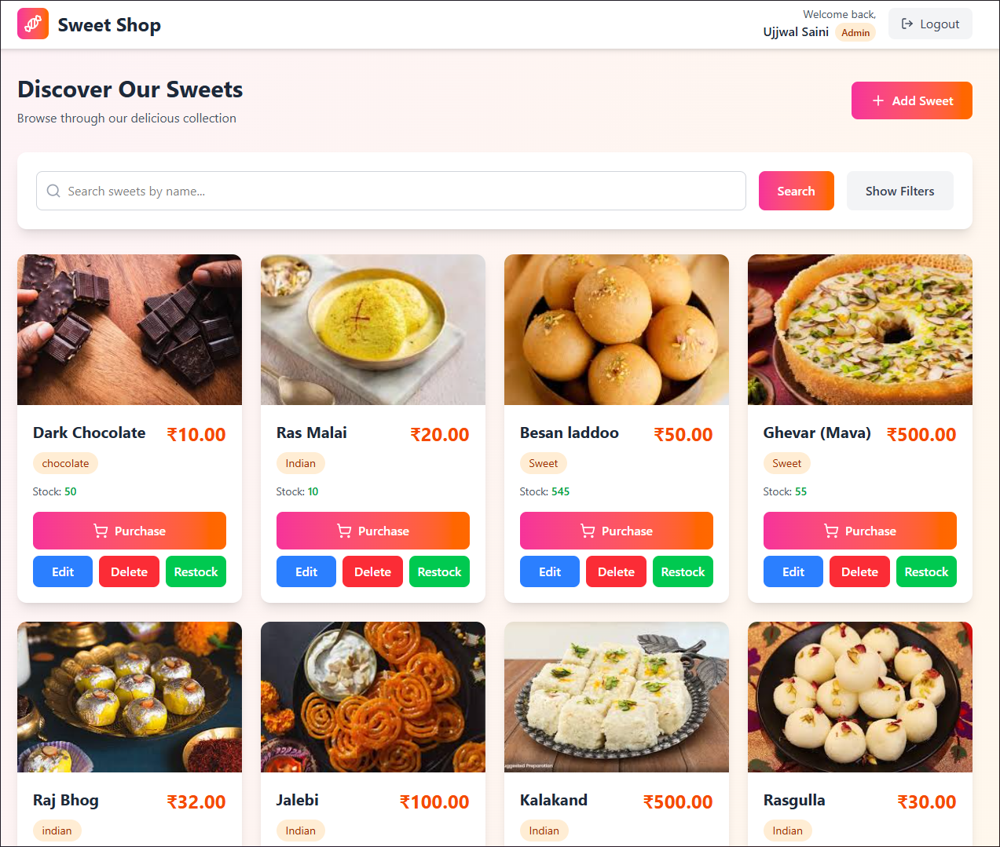
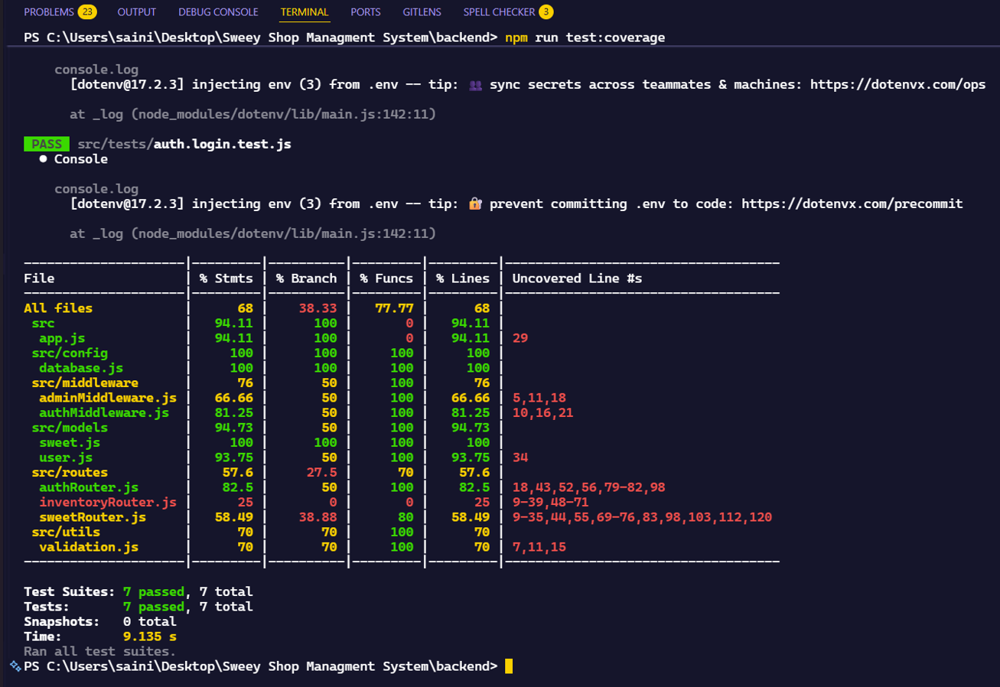

🍬 Sweet Shop Management System

A full-stack web application for managing a sweet shop's inventory, user authentication, and purchase workflows. Built following Test-Driven Development (TDD) principles with a modern MERN stack architecture.


## 📋 Table of Contents

- [Screenshots](#-screenshots)
- [Features](#-features)
- [Tech Stack](#-tech-stack)
- [Prerequisites](#-prerequisites)
- [Installation](#-installation)
- [Configuration](#-configuration)
- [Usage](#-usage)
- [Project Structure](#-project-structure)
- [API Endpoints](#-api-endpoints)
- [Testing](#-testing)
- [My AI Usage](#-my-ai-usage)


## ✨ Features

## 📸 Screenshots

### Main Page of Website


### Test Report



### Authentication & Authorization
- User registration and login
- Secure JWT-based authentication with HTTP-only cookies
- Role-based access control (Admin & User)
- Protected routes and API endpoints

### Inventory Management
- **CRUD Operations**: Create, Read, Update, and Delete sweets
- **Search Functionality**: Search sweets by name, category, and price range
- **Purchase System**: Users can purchase sweets (reduces inventory)
- **Restock System**: Admins can restock inventory
- Real-time inventory updates

### User Experience
- Modern, responsive React SPA with Tailwind CSS
- Intuitive dashboard interface
- Modal-based interactions for purchases and inventory management
- Smooth authentication flow

### Development Practices
- Test-Driven Development (TDD) approach
- Comprehensive test coverage for backend APIs
- Frontend testing with Vitest and React Testing Library
- Clean architecture and separation of concerns

## 🛠 Tech Stack

### Backend
- **Runtime**: Node.js
- **Framework**: Express.js
- **Database**: MongoDB with Mongoose
- **Authentication**: JWT (JSON Web Tokens) with bcrypt
- **Testing**: Jest & Supertest
- **Development**: Nodemon

### Frontend
- **Framework**: React 19
- **Build Tool**: Vite
- **Styling**: Tailwind CSS
- **Icons**: Lucide React
- **Testing**: Vitest & React Testing Library

## 📦 Prerequisites

Before you begin, ensure you have the following installed:
- **Node.js** (v14 or higher)
- **npm** or **yarn**
- **MongoDB** (local installation or MongoDB Atlas account)

## 🚀 Installation

1. **Clone the repository**
   ```bash
   git clone <repository-url>
   cd Sweet-Shop-Managment-System
   ```

2. **Install backend dependencies**
   ```bash
   cd backend
   npm install
   ```

3. **Install frontend dependencies**
   ```bash
   cd ../frontend
   npm install
   ```

## ⚙️ Configuration

1. **Backend Environment Variables**

   Create a `.env` file in the `backend` directory:
   ```env
   PORT=3000
   DB_CONNECTION_SECRET=your_mongodb_connection_string
   JWT_SECRET=your_jwt_secret_key
   ```

   - `DB_CONNECTION_SECRET`: Your MongoDB connection string (e.g., `mongodb://localhost:27017/sweet-shop` or MongoDB Atlas connection string)
   - `JWT_SECRET`: A secure random string for signing JWT tokens

2. **Frontend Configuration**

   The frontend is configured to connect to `http://localhost:3000` by default. If your backend runs on a different port, update the API base URL in `frontend/src/services/api.js`.

## 💻 Usage

### Development Mode

1. **Start the backend server**
   ```bash
   cd backend
   npm run dev
   ```
   The backend will run on `http://localhost:3000`

2. **Start the frontend development server**
   ```bash
   cd frontend
   npm run dev
   ```
   The frontend will run on `http://localhost:5173`

3. **Open your browser**
   Navigate to `http://localhost:5173` to access the application

### Production Mode

1. **Build the frontend**
   ```bash
   cd frontend
   npm run build
   ```

2. **Start the backend**
   ```bash
   cd backend
   npm start
   ```

## 📁 Project Structure

```
Sweet-Shop-Managment-System/
├── backend/
│   ├── src/
│   │   ├── config/
│   │   │   └── database.js          # MongoDB connection
│   │   ├── middleware/
│   │   │   ├── authMiddleware.js    # JWT authentication
│   │   │   └── adminMiddleware.js   # Admin role verification
│   │   ├── models/
│   │   │   ├── user.js              # User schema
│   │   │   └── sweet.js             # Sweet schema
│   │   ├── routes/
│   │   │   ├── authRouter.js        # Authentication routes
│   │   │   ├── sweetRouter.js       # Sweet CRUD routes
│   │   │   └── inventoryRouter.js   # Inventory management routes
│   │   ├── tests/                   # Backend test files
│   │   ├── utils/
│   │   │   └── validation.js        # Input validation utilities
│   │   ├── app.js                   # Express app configuration
│   │   └── server.js                # Server entry point
│   ├── package.json
│   └── .env                         # Environment variables
│
├── frontend/
│   ├── src/
│   │   ├── components/
│   │   │   ├── SweetCard.jsx        # Sweet display card
│   │   │   ├── SweetModal.jsx       # Create/Edit sweet modal
│   │   │   ├── PurchaseModal.jsx    # Purchase sweet modal
│   │   │   ├── RestockModal.jsx     # Restock inventory modal
│   │   │   ├── DeleteModal.jsx      # Delete confirmation modal
│   │   │   └── SearchBar.jsx        # Search component
│   │   ├── pages/
│   │   │   ├── Login.jsx            # Login page
│   │   │   ├── Register.jsx         # Registration page
│   │   │   └── Dashboard.jsx        # Main dashboard
│   │   ├── context/
│   │   │   └── AuthContext.jsx      # Authentication context
│   │   ├── services/
│   │   │   └── api.js               # API service layer
│   │   ├── App.jsx                  # Main app component
│   │   └── main.jsx                 # React entry point
│   ├── package.json
│   └── vite.config.js
│
└── README.md
```

## 🔌 API Endpoints

### Authentication
- `POST /api/auth/register` - Register a new user
- `POST /api/auth/login` - Login user
- `POST /api/auth/logout` - Logout user

### Sweets Management
- `GET /api/sweets` - Get all sweets (with optional search parameters)
- `GET /api/sweets/:id` - Get a specific sweet
- `POST /api/sweets` - Create a new sweet (Admin only)
- `PUT /api/sweets/:id` - Update a sweet (Admin only)
- `DELETE /api/sweets/:id` - Delete a sweet (Admin only)

### Inventory Management
- `POST /api/inventory/sweets/:id/purchase` - Purchase a sweet (reduces quantity)
- `POST /api/inventory/sweets/:id/restock` - Restock a sweet (Admin only)

## 🧪 Testing

### Backend Tests
Run backend tests using Jest:
```bash
cd backend
npm test

---

## 🤖 My AI Usage

This project was developed with the assistance of AI tools to enhance productivity and code quality. The following AI tools were used:

### AI-Assisted Development
- **Cursor AI** - Used for code generation, refactoring, and debugging throughout the development process
- **AI Code Completion** - Assisted with boilerplate code, API endpoint creation, and component structure
- **AI Documentation** - Helped generate comprehensive README documentation and code comments

### Areas Where AI Was Used
- **Backend Development**: API route setup, middleware implementation, and database schema design
- **Frontend Development**: React component creation, state management, and UI/UX improvements
- **Testing**: Test case generation and test structure setup
- **Documentation**: README file creation and API documentation
- **Code Review**: Suggestions for code optimization and best practices